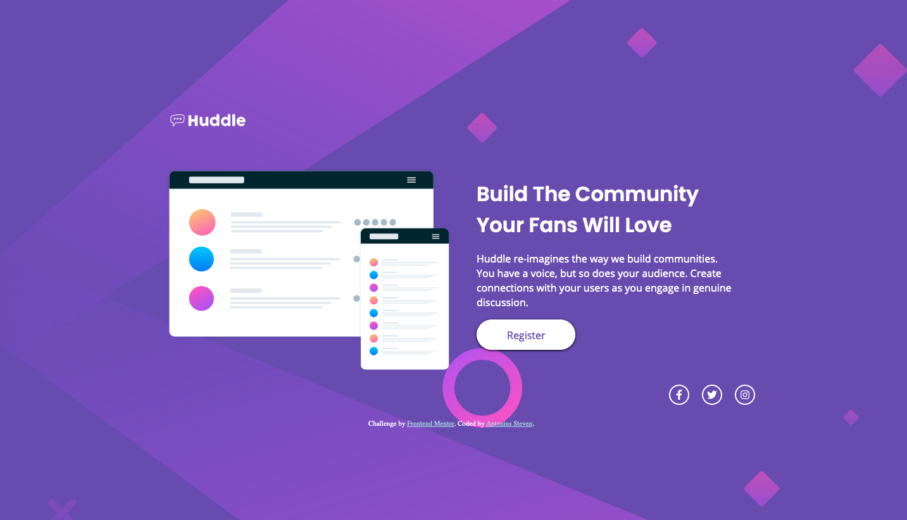

# Frontend Mentor - Huddle landing page with single introductory section solution

This is a solution to the [Huddle landing page with single introductory section challenge on Frontend Mentor](https://www.frontendmentor.io/challenges/huddle-landing-page-with-a-single-introductory-section-B_2Wvxgi0). Frontend Mentor challenges help you improve your coding skills by building realistic projects.

## Table of contents

- [Overview](#overview)
  - [The challenge](#the-challenge)
  - [Screenshot](#screenshot)
  - [Links](#links)
- [My process](#my-process)
  - [Built with](#built-with)
  - [What I learned](#what-i-learned)
  - [Continued development](#continued-development)
  - [Useful resources](#useful-resources)
- [Author](#author)

## Overview

### The challenge

Users should be able to:

- View the optimal layout for the page depending on their device's screen size
- See hover states for all interactive elements on the page

### Screenshot

### Links

- Solution URL: [Solution](https://github.com/ASteven21/Huddle-Landing-Page)
- Live Site URL: [Live Web](https://asteven21.github.io/Huddle-Landing-Page/)

## My process

### Built with

- Semantic HTML5 markup
- CSS custom properties
- Flexbox
- Mobile-first workflow

### What I learned

- In this challenge I learned about implementing font awesome and also about using the background-size property's contain and cover values to work with the mobile version and the dektop version of the landing page.

### Continued development

- I hope that I can get used to use the background-size property since it took me some time in order figure out how to make the background picture to have a full size.

### Useful resources

- [Kevin Powell](https://www.youtube.com/watch?v=3T_Jy1CqH9k) - I learned about "background-size: contain;" from here.

## Author

- Website - [GitHub](https://github.com/ASteven21)
- Frontend Mentor - [@ASteven21](https://www.frontendmentor.io/profile/ASteven21)
